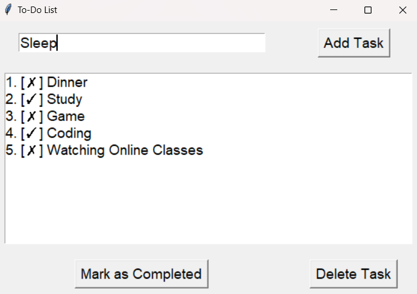

#TO DO LIST

## To-Do List Application 📱

Description
A to-do list application is a productivity tool designed to help users organize tasks, set priorities, and manage time effectively. It enables users to track tasks, deadlines, and progress, making it easier to stay focused and complete objectives.

## Screenshot🤖

## Key Features 🎗️
1. Task Management
Add Tasks: Quickly create new tasks with titles and optional descriptions.
Edit Tasks: Modify existing tasks as priorities change.
Delete Tasks: Remove tasks that are no longer relevant.
2. Categorization and Organization
Categories/Labels: Group tasks into categories like work, personal, shopping, etc.
Prioritization: Assign high, medium, or low priority levels to tasks.
3. Scheduling and Reminders
Due Dates: Assign deadlines to tasks to ensure timely completion.
Reminders: Receive notifications for upcoming or overdue tasks.
4. Progress Tracking
Task Completion: Mark tasks as completed and view completed tasks in a separate section.
Progress Visualization: Display progress bars or pie charts for an overview of completed versus pending tasks.
5. Synchronization and Accessibility
Cloud Sync: Sync data across devices to access your to-do list from anywhere.
Offline Access: Access tasks without needing an internet connection.
6. Customization
Themes: Choose from different color themes for better usability.
Custom Views: View tasks by day, week, or category.
7. Collaboration
Shared Lists: Collaborate with others by sharing task lists for team projects or events.
Comments/Notes: Add comments to tasks for better communication.
8. Integrations
Calendar Integration: Sync with Google Calendar, Outlook, or Apple Calendar.
Third-party Apps: Integration with apps like Slack, Microsoft Teams, or Zapier for automation.
9. Advanced Features (Optional)
Recurring Tasks: Set recurring tasks for daily, weekly, or monthly schedules.
Subtasks: Break down larger tasks into smaller, manageable subtasks.
AI Suggestions: Receive automated suggestions to prioritize or reschedule tasks.

## How It Works 💫🌟
User Registration:

Sign up or log in using email, Google, or other credentials.
Dashboard:

Access a clean interface displaying tasks organized by categories, priorities, or deadlines.
Adding Tasks:

Click an "Add Task" button to input the task's title, description, due date, and priority level.
Organizing Tasks:

Use drag-and-drop functionality to rearrange tasks or assign them to categories.
Notifications and Reminders:

Receive alerts via email, push notifications, or SMS for upcoming deadlines.
Marking and Tracking:

Mark tasks as completed and track progress visually through charts or dashboards.
Sharing and Collaboration:

Invite others to a shared list, assign tasks to collaborators, and exchange comments.
Synchronization:

Sync tasks automatically across multiple devices through cloud-based storage.
Data Backup and Analytics:

Save your to-do list data in the cloud and access reports to analyze productivity trends.
Implementation Platforms
Mobile Apps: Android, iOS
Web Apps: Accessible through browsers
Desktop Applications: Windows, macOS

## Installation and Requirements💻
Python Version:🐍

Ensure you have Python 3.6+ installed on your system. Libraries:

The application uses only the standard Python library (tkinter). Steps:

Clone or download the repository. Run the script using python to_do_list.py.
